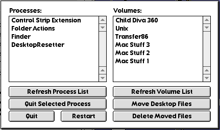

# DesktopResetter
I wrote this application to streamline "rebuilding the desktop" in Mac OS Classic using what I've determined to be the safest method: moving the existing desktop database into a folder, restarting, and then deleting the folder.

(I've tried other applications and extensions made for this purpose, and have found them to be too unreliable or unstable.)

Written in C, compiled with [Retro68](https://github.com/autc04/Retro68), and tested on System 6.0.8 under Mini vMac and Mac OS 9.0.4 under SheepShaver. The compiled application is 12K.

On the left side is a list of open processes. This only appears if running under System 7 or later. You can select any number of processes and tell them to quit, including the Finder! If you quit all processes, the Finder will relaunch itself. If you hold down Command and Option while doing this, the Finder will ask you if you wish to rebuild the desktop on each writable drive.

If that doesn't work, on the right side is a list of mounted drives. You can select any number of drives and move their desktop databases into a folder called "old desktop files." Upon restarting, the Finder will rebuild the desktop on the selected drives. (Under System 7 and later, relaunching the Finder is insufficient, as the operating system itself still has an open file handle on the desktop database even though it has been moved.) You can then move "old desktop files" to the Trash or use the dedicated button for deleting the moved files.

(If a mounted drive is an MFS disk, which does not have real folders, the desktop files will be renamed instead of moved. The dedicated button can then be used for deleting the renamed files, as it is a little difficult to drag an invisible file to the Trash.)

**This will remove all Finder comments.**
